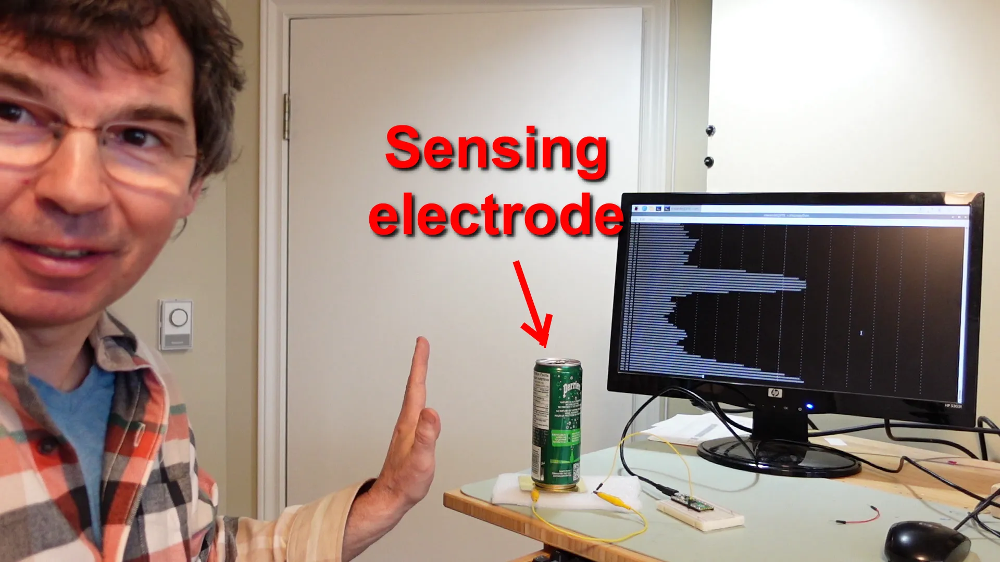
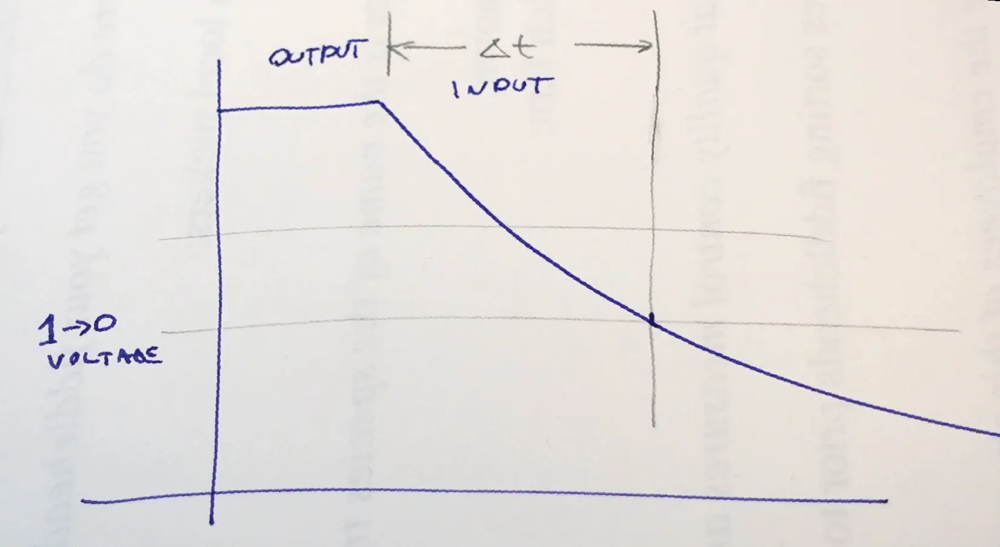
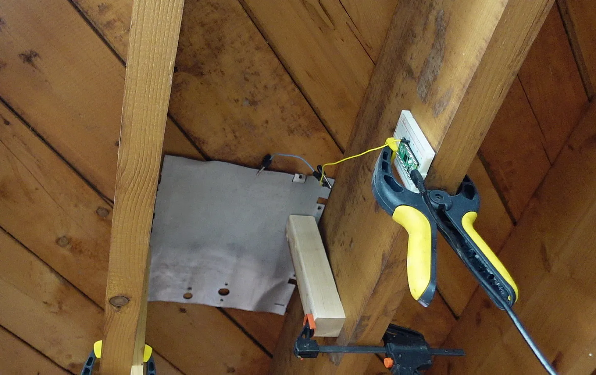
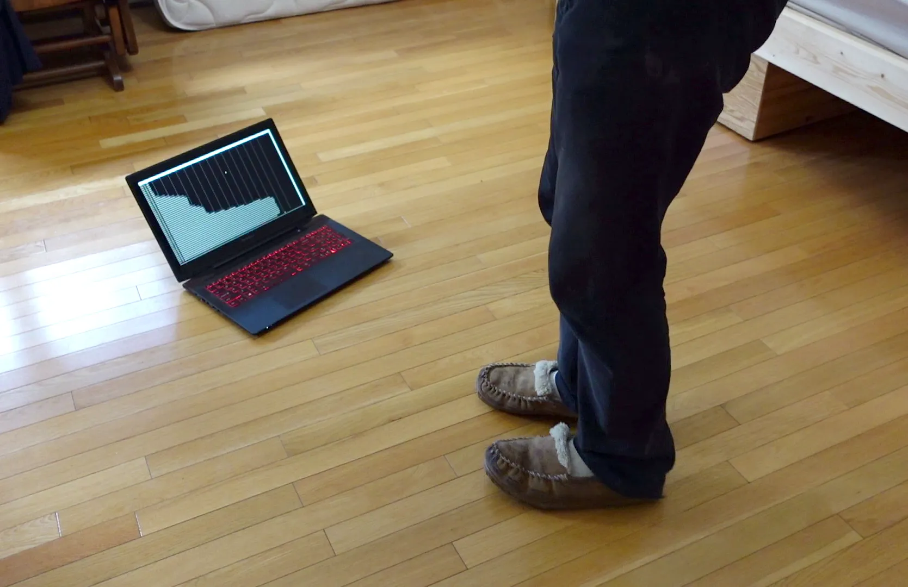
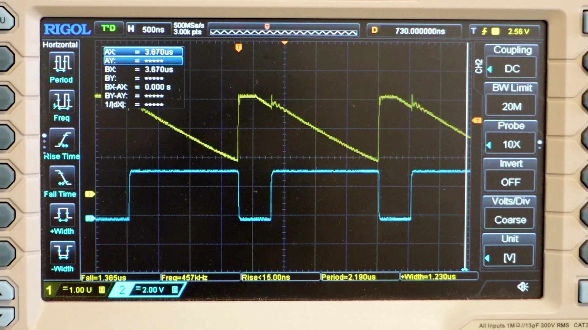
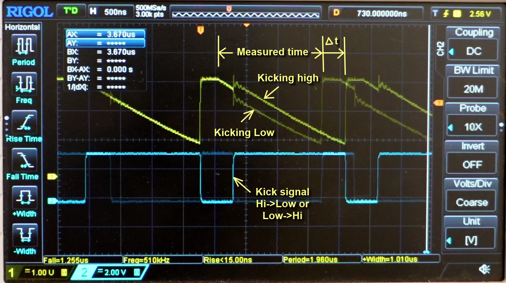
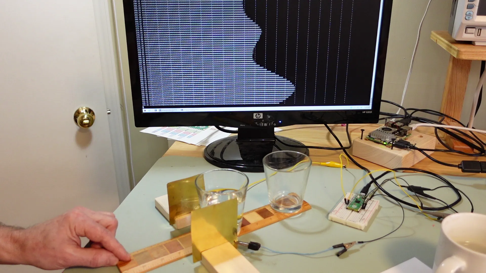
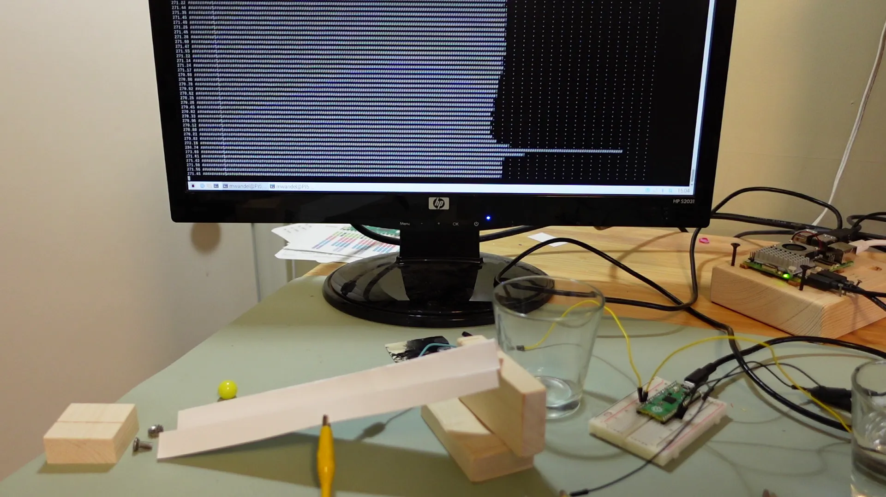
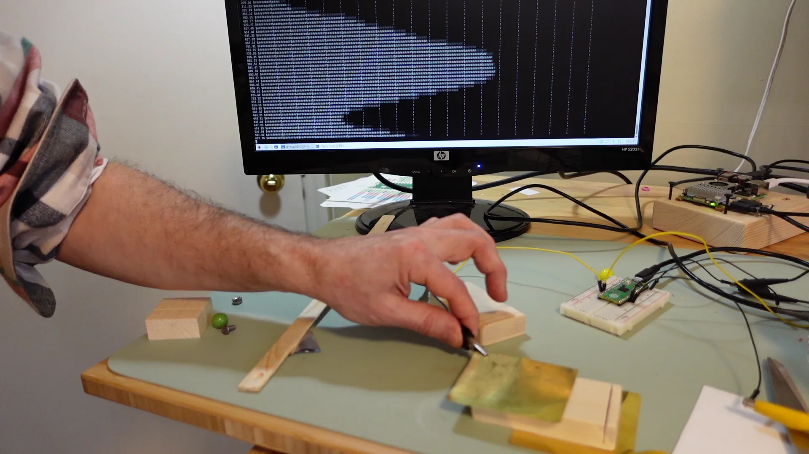
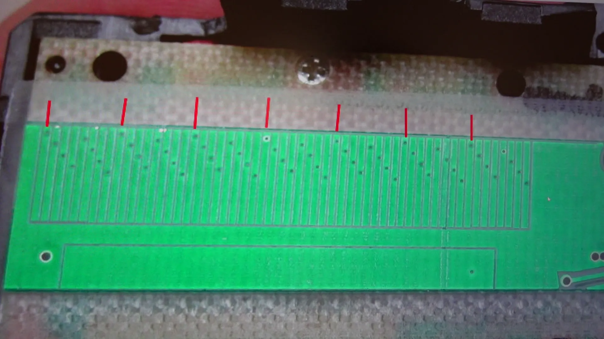

<html>
<body>
<h1>Relative measurements of very low capacitances using timing on digital I/O lines using Pi Pico PIO state machines</h1>

This repository has the code to go with my video: <a href="https://youtu.be/2uuutrcaAZ0">https://youtu.be/2uuutrcaAZ0

Measuring very low capacitance value changes (down to 10s of fremtofarads) by toggling output lines on a Pi Pico
and timing how long it takes for the line to transition from 1 to 0 using the PIO state machine.

This is able to detect capacitance changes just from changes of my proximity to  the electrode.

The way this works is that the output line is driven high for a few microseconds, then switched to an input, with
the Pi Pico's internal pull-down enabled, and then timing how long it takes for the input to read zero.

This is timed by code running on one of the Pico's PIO state machines and reported back to MicroPython.

This is sensitive enough that by placing an "electrode" below the floor, I was able to easily detect
the proximity of a person near the electrode on the floor above.

The waveforms seen on the scope show the initial drive high, then letting it decline until it crosses
the zero threshold.

For measuring capacitance between two lines, as opposed to capacitance to ground, I set the output line high as before, but while it is dropping, I toggle another output line alternately high or low.  Any capacitance between the two GPIO lines will affect how long it takes for the line to drop to zero.  The difference between the time I get with the other line going high vs going low is representative of the capacitance between the two GPIO lines.

Measuring cross capacitance is less senstitive to my proximity and can detect objects between two plates, it can detect the difference between a glass of water and an empty glass.

This can also measure objects sliding down a ramp.  A short section of the ramp has electrodes on either side of it, and an object such as a screw sliding past will cause a temporary increase in capacitance.  It also works on non-conductive objects due to the dielectric constant of the object.

My goal originally had been to have something that can measure absolute linear distance by measuring the capacitance of plates sliding across each other.  But this is also sensitive to the distance between the plates, so it would be difficult to get precise measurements that way.

The way calipers have a repeating patterns of many pads is a much better approach for getting very precise readings, even if the two circuit boards are not precisely aligned.  But this approach requires counting how many intervals have been moved across for larger measurements, which means afterpowering down and up again, the zero reference is lost.

